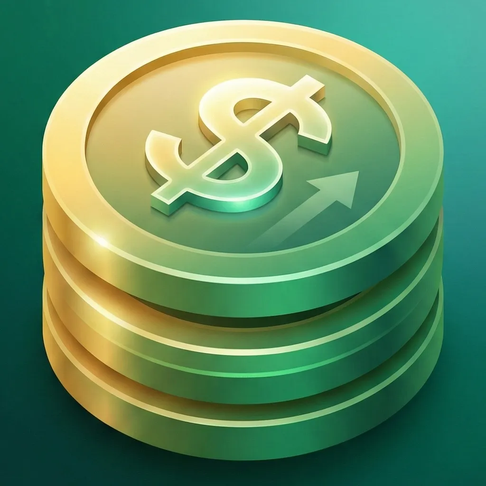
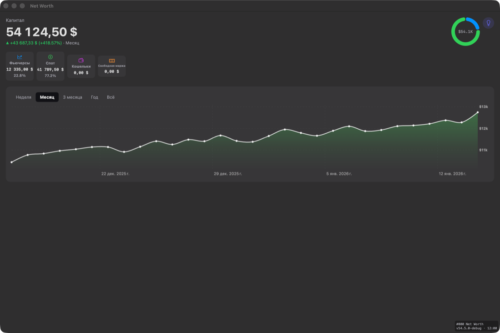
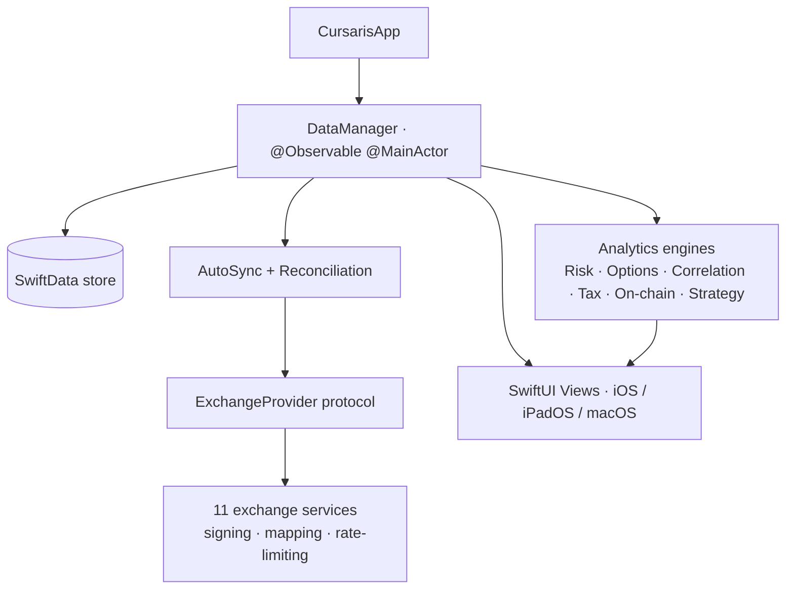
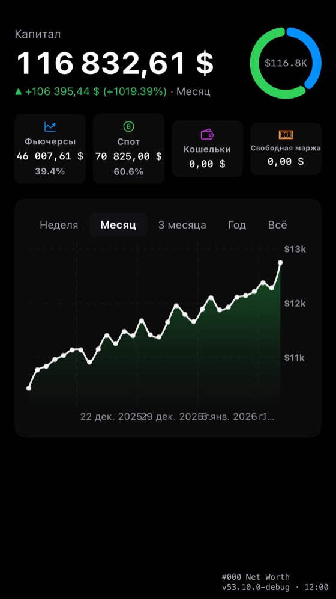
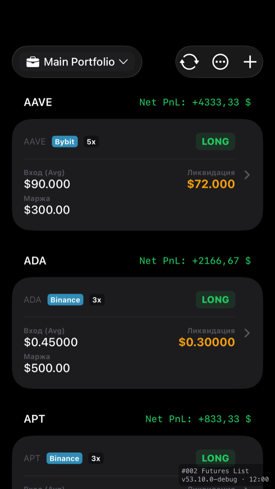
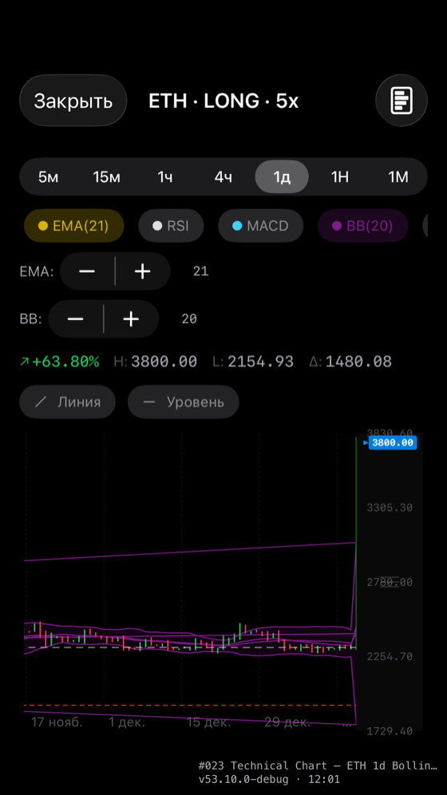
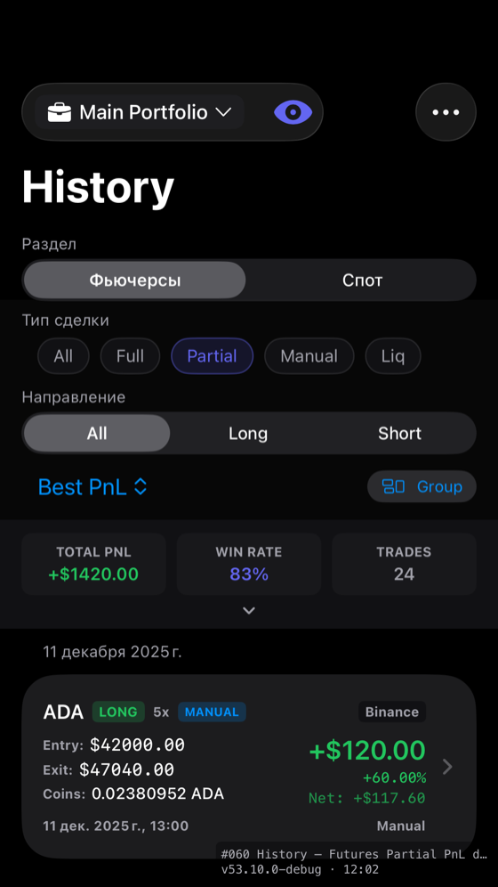
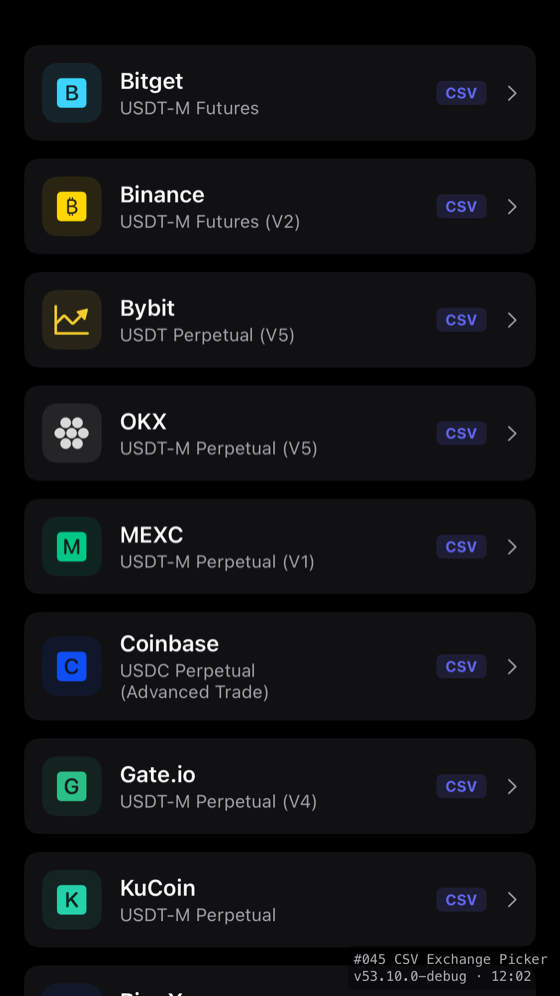
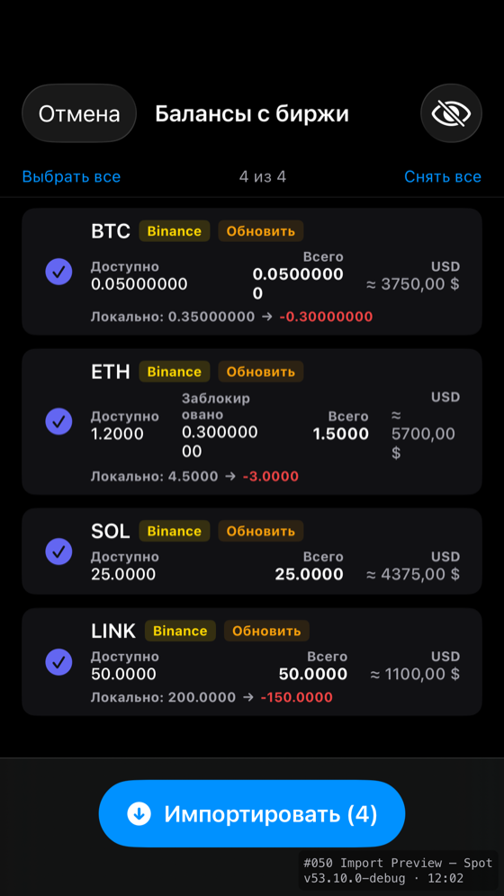
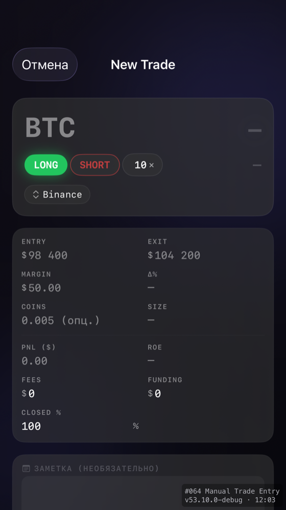

  <!-- ASSET: add docs/assets/logo.png (~256px square) when the new logo is ready, then uncomment:
   -->

  <h1>Cursaris</h1>

  
<b>A native iOS · iPadOS · macOS terminal for tracking crypto-futures portfolios across 11 exchanges — sync, reconciliation, risk and tax analytics in one app.</b>

  

    
    
    
    
    
    
  

  

    <a href="#-screenshots">Screenshots</a> ·
    <a href="#-architecture--engineering">Architecture</a> ·
    <a href="#-source-code--access">Request a walkthrough</a>
  

  <!-- TEMP hero: a macOS screenshot. Swap for an 8–15s demo GIF (docs/assets/hero-demo.gif) when ready. -->
  

---

## Overview

Cursaris is a personal trading terminal for active crypto-futures traders. It connects to 11 exchanges through read-only API keys, pulls live positions and trade history, and reconciles them against local state — detecting partial and full closes, deduplicating fills, and computing weighted-average exit prices. On top of that sync layer it adds risk, tax, options, on-chain and strategy tooling, all on one shared data model, fully offline-capable, across iPhone, iPad and Mac.

I built it solo over roughly four months as an AI-augmented developer. It is feature-complete, with an App Store release planned for ~August 2026.

---

## ✨ Highlights

| | |
|---|---|
| **~150,000** lines of production Swift | **708** source files (~224k LOC including tests) |
| **~3,900** automated tests · **9,000+** assertions | **11** crypto-exchange integrations |
| **8** UI languages | **3** Apple platforms from one codebase (+ watchOS & widgets) |

---

## Features

Cursaris is broad on purpose — it covers the full lifecycle of a futures position, from entry planning to tax reporting. Features are grouped below; the analytics features are AI-assisted in their math and are presented here as product capabilities.

### Portfolio sync & reconciliation — the core
- **11-exchange unified import** — Binance, Bybit, OKX, Bitget, MEXC, Coinbase, Gate.io, KuCoin, BingX, Kraken, Bitfinex, all behind one provider interface.
- **Smart reconciliation** — diffs local positions against the live exchange snapshot to detect partial closes, full closures and reopened positions.
- **Trade-fill detection** — VWAP exit-price aggregation, trade-ID deduplication, and a coin-diff fallback when an exchange's trade endpoint degrades.
- **Auto-sync** — background polling with an inbox for pending events and throttled notifications.

### Position tracking
- Futures positions with leverage, DCA step planning, liquidation estimates and breakeven.
- Spot holdings with cost-basis (FIFO / LIFO / weighted-average / HIFO) and realized/unrealized PnL.
- Closed-trade history with filtering, grouping, editing and per-trade journaling.

### Analytics & intelligence (features)
- **Risk** — Value-at-Risk (historical + Monte Carlo), stress testing, concentration and margin forecasting.
- **Options Lab** — Black-Scholes Greeks, IV surface, max-pain and put/call ratio (Deribit data).
- **Correlation matrix**, **liquidation heatmap**, and a cross-market (TradFi) correlation view.
- **Tax dashboard** — per-jurisdiction spot + futures gains, harvesting opportunities, PDF/CSV export.
- **On-chain / DeFi** — EVM wallet balances, Aave health-factor and staking positions across 5 chains.
- **Strategy builder & backtesting** — visual rule engine, Monte Carlo and walk-forward validation.
- **Macro-pulse** — open interest, funding, long/short ratios, Fear & Greed.

### Platform & hardware
- **NFC hardware-wallet reading** (Tangem / Keycard / Ledger / NDEF) on iOS.
- **Interactive home-screen widgets** with App Intents, plus a watchOS companion.
- **8 languages**, full dark theme, privacy mode, local-only data.

---

## 🛠 Tech Stack

**Language & UI**
- Swift 5, SwiftUI, SwiftData
- `@Observable` state model, structured concurrency (`async/await`, actors)

**Data & networking**
- REST against 11 exchange APIs + several public market-data feeds
- HMAC-SHA256 / SHA384 / SHA512 and JWT ES256 request signing (CryptoKit)
- Apple Accelerate (vDSP / BLAS) for vectorized math in the analytics engines

**Tooling & process**
- GitHub Actions CI (build + test + localization quality gate)
- AI-orchestrated development with Claude Code, under an automated verification pipeline
- Apple String Catalogs (`.xcstrings`) for localization, with a glossary-locked translation pipeline

---

## 🏗 Architecture & Engineering

The defensible engineering in Cursaris is in its systems work — the exchange layer, the sync engine, the test discipline, and the development workflow that made a project this size tractable for one person.

### One provider, eleven exchanges
Every exchange sits behind a single `ExchangeProvider` protocol. Adding one means writing a service, a position/trade mapper, a model layer, and a signing variant — not touching the sync engine. The eleven differ in nearly every dimension that matters:

- **Auth** — HMAC-SHA256 (most), HMAC-SHA384 (Bitfinex), HMAC-SHA512 (Gate.io, Kraken), and JWT **ES256** asymmetric signing (Coinbase, via CryptoKit P-256).
- **Shape** — keyed JSON vs Bitfinex's positional arrays; `code: Int` vs `code: String` success envelopes; cursor vs page-number vs HTTP-header pagination.
- **Quirks** — dual domains and dual auth schemes (MEXC, KuCoin, Kraken), hashed passphrases (KuCoin), four-credential models (Kraken), USDC/USD-margined contracts, and ticker formats from `XBTUSDTM` to `tBTCF0:USTF0` normalized to a common symbol.

### Sync & reconciliation engine
The sync is a fixed pipeline — **Fetch → Detect → Import → Reconcile** — ordered deliberately so partial-close detection runs while local fill counts are still intact (the reorder fixes a class of "absorbed close" bugs). It does VWAP exit-price aggregation, trade-ID dedup, a coin-diff fallback for degraded trade endpoints, and graceful per-exchange error isolation so one failing exchange never blocks a multi-exchange sync.

### Test discipline at scale
~3,900 automated tests with 9,000+ assertions back the codebase — concentrated where it matters: exchange mappers, the reconciliation chain, position math, and every analytics engine. Tests run on in-memory stores for isolation and execute in CI on every push.

### AI-orchestrated development workflow
Beyond the app, I built tooling to make solo development at this scale safe: a debug RPC server, a screenshot-tour harness that captures every screen across platforms and locales, OCR-based localization-bleed detection, and a static audit suite enforcing localization and code-quality invariants. These run as gates so that AI-generated changes are verified, not trusted.

---

## 🤖 Built solo, with AI — and a verification discipline

Cursaris was developed by one person using Claude Code as the primary implementation tool. I treat that as a strength, not a shortcut: the leverage is real, but it only produces a shippable product if every change is verified.

So the project is wrapped in machinery that assumes generated code is wrong until proven otherwise — a full automated test suite, a CI quality gate, a multi-platform screenshot tour with vision-based UI checks, and static audits for localization and structural invariants. My role was the system design, the architecture decisions, the integration work, and building (and trusting) that verification layer.

I'm honest about scope: the quantitative-finance math in the analytics engines was AI-assisted. I present those as product features, and lead with the engineering I'd defend line by line — the exchange layer, the sync engine, and the workflow that kept 150k lines coherent.

---

## 📸 Screenshots

<table>
  <tr>
    <td align="center"> Net Worth — overview</td>
    <td align="center"> Futures + DCA</td>
  </tr>
  <tr>
    <td align="center"> Technical chart (Bollinger)</td>
    <td align="center"> Trade history</td>
  </tr>
  <tr>
    <td align="center"> Exchange connect</td>
    <td align="center"> Import preview</td>
  </tr>
</table>

More

<table>
  <tr>
    <td align="center"> Manual trade entry</td>
  </tr>
</table>

---

## 🔒 Source code & access

Cursaris is a **commercial, closed-source product** (App Store release planned for ~August 2026), so the source is not public. This repository documents the architecture and engineering.

I'm happy to give a **private walkthrough on a call** — a guided tour of the architecture, a deep dive on the trickiest subsystem (the reconciliation engine or the exchange-signing layer), and, if useful, a live extension/debugging exercise in the actual codebase.

---

## 👤 Author

**Oleksandr Uskov** — MSc Computer Science student · AI-augmented solo developer

- Email: oleksandruskov.it@gmail.com
- Telegram: [@Alexus27](https://t.me/Alexus27)
- LinkedIn: <!-- ASSET: linkedin url -->

---

Stated figures (LOC, file count, test count, exchange count) reflect the private codebase and are available for verification during a walkthrough.
